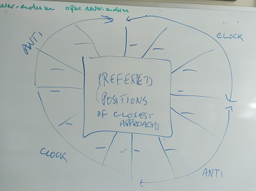

## 18 May 2025
flex diagramming --- upgrade support for annotations on route endpoints.

Support a second label at each end of a route.

### Overview and Rationale
1. support a second label at each end of a route so that can draw diagrams with cardinality as a text label as in UML.
2. Generalise label positioning so that works on sloping terminal arms as well as horizontal and vertical as at present. 
3. Gravitate toward more general orientation directives -- focus on clockwise
and anticlockwise instead of left, right, high and low as at present. 
4. Fix a feature/bug --- do not to create empty labels when no annotations are specified.
(Currently get a warning messages when a route has no annotation on one end or another.)
by creating labels conditionaly.

### Language
+ routes are directional they lead from a source enclosure to a destination enclosure,
+ routes follow paths which are sequences of points and line segments,
+ lines segments are cardinals (ns and ew) and ramps,
+ a route has two terminating points one is flagged as the startpoint the other as the endpoint,
+ route has to terminal arms one is flagged as the startarm and the other as the endarm,
+ a route currently has two labels. One is attached to the startpoint and one to the endpoint.
+ the text of the labels can be specified as the source/annotation and the destination/annotation and rules 
then represent the labels on their respective endpoints.

### Aside
Much code would be simpler if a route was represented by a pair of paths to a midpoint. Unless we do this change which involves writing new code as well as simplifing existing code (and whichI don't want to do just now) there needs to be different rules for start points and arms to end points and arms. So be it.

### Analysis
In the current code, irrespective of the presence or absence of annotations,
+ a label is created on the startpoint of a route by the rule which creates
startpoint and startarm of a route in source `diagram..path-+point.startpoint+ewQ.xslt`.
+ a label is created on the endpoint of a route by the rule which creates
endpoint and endarm of a route in source `diagram..path-+point.endpoint+ewQ.xslt`. 

Subsequently,
+ the text of the label is populated from appropriate annotation by a rule in source `diagram..route.path.point.label-+text.xslt`;
+ the text style of the label is populated from that specified for the route by a rule in `diagram.text_style.xslt`. This file name ought to change, btw, to diagram..label-+text_style;
+ the x of a label is populated by rules in source `diagram...route.path.point.label-+xP`;
+ the y of a label is populated by the duals of the rules for x.

### Recap
In the current code, labels are positioned so as to avoid conflicting with crowsfeet or arrowheads or other markers at the tip (the terminating point) of the terminal arm. 
To achieve this two distances the source and destination of the route
have attributes `label_lateral_offset` and `label_long_offset`. These attributes are set to contain values determined by the line_style of the route and its endline markers (it would be possible to specify these directly in the diagram if required). The  rules for these attributes are, respectively,
in the source files `diagram...route.node-+label_long_offset`. There is no need to change to this particular code, by the way, but the filename ought to be changed. It should be `diagram...route.node-+label_long_offset+label_lateral_offset`. 

Proviso: The rules defined in this file don't actually take into account the end markers they simply use the line style --- should improve in the future to implement as I first imagined.

### Design
There will be schematic places for positioning labels.

Imagine a wheel with spokes radiating out in all directions.
Imagine the hub of the wheel as an enclosure and the spokes as possible terminal arms of routes.
Imagine the spokes to be labelled and that the labels overlay neither the hub nor the spokes.
Such a label can be said to be postitioned clockwise or anticlockwise depending on its position either
earlier or later than the spoke it labels. 

In this way we have explained how the terminal arm of a route can be labelled in a clockwise postion or an anticlockwise position. 

To illustrate this
+ For routes connected to the top edge of an enclosure 
   + clockwise labels are on left of the endarm
   + anticlockwise labels are on right
+ For routes connected to the right hand side 
   + clockwise routes are lower than the endarm
   + anticlockwise routes are higher

in a similar manner, routes connected to the bottom edge or the left hand side have a clockwise and anticlockwise label positions. 

### Angle theta of an terminal arm.
Terminal arms can radiate out in all 360 degrees from an enclosure. The actual angle of the endarm will be refered to as theta. We follow compass bearings so that 
+ zero degrees is an endarm heading directly upwards due north,
+ pi/2 is due east i.e. an endarm heading away to the right hand side,
+ pi is due south,
+ -pi/2 is due west,
+ -pi + infinitessimal is infinitessimally close to due south. 

### Preferred Positions for Labels
#### Preferred Label Position Non-Cardinals - Position of Closest Approach

If you look at the wagon wheel,  for those spokes that are not cardinals then there is a preferred label position which gives most room for a close approach to both endarm and enclosure.

In this diagram 

,

you see that the closest position is the *clockwise* position in the following quadrants
+ north west ( 0 < theta < pi/2)
+ south east ( pi < theta < 3/2 pi )

and is the *anticlockwise* position in the other quadrants
+ south west (pi/2 < theta < pi)
+ north east (3/2 pi < theta < 2pi)

#### Preferred Label Position North-South Cardinals
For cardinals there is no position of closest approach. One obvious tactic, and one that I have followed
informally, is to annotate north-south endarms left or right depending on whether they connect to the left or right half of the top or bottom edge. WE get the following decision table
+ top left --- anti-clockwise
+ top right --- clockwise
+ bottom left --- clockwise
+ bottom right -- anti-clockwise
These nicely fit with the non-cardinals.

#### Preferred Label Position East-West Cardinals

Define the preferred label position for all east west cardinals to be the *anti-clockwise* position.
This is a convention rather than a space saver. The result is that for a simple east west relationship we get the end labelling as follows
```
------+                   +------
      | label1            |
      |-------------------|                         
      |            label2 |
------+                   +------
```
(both label1 and label2 are in the anti-clockwise position).


### Anchor points Hc and Ha.
Note that these are merely conceptual points --- they are not represented by instances of points in the flex representation of the diagram.

Imagine a terminal arm having a rectangular box. 
This box has two corners that are relevant to label positioning.
These are Hc and Ha. Hc is the corner in the clockwise direction and Ha is the corner in the anticlockwise direction. 

Ha and Hc are at a distant h from the endpoint of the route where h is given by pythagorous from 
label_lateral_offset and label_long_offset as, say,
```
h = root(lat^2 +long^2)
```
The hypotenuse meets the terminal arm at the terminal point of the route. Denote by alpha the angle between the two.
Alpha us given by
```
alpha = tan^-1(lat/long)
```

### Equations for calculating x and y for the point Hc.
Assume x and y are the usual cartesian coordinates (in particular that, unlike the flex coordinate system, y grows in an upward direction).
If theta is greater that zero (for endarms leaving from left to right)
then from h, theta and alpha we can calculate x and y values 
of Hc as follows
```
Hc.x =  cos(pi/2 - theta - alpha) * h
Hc.y =  sin(pi/2 - theta - alpha) * h
```
If theta is less that zero then the value for x needs to be negated. Therefore, for all theta
the x and y values can be calculated as
```
Hc.x =  sign(theta) * cos(pi/2 - theta - alpha) * h
Hc.y =  sin(pi/2 - theta - alpha) * h
```

The formula for the anticlockwise corner Ha are obtained by negating alpha to get:
```
Ha.x =  sign(theta) * cos(pi/2 - theta + alpha) * h
Ha.y =  sin(pi/2 - theta + alpha) * h
```

### Secondary label Positions
If an terminal arm has two labels and one label takes the preferred position then the other label
must take a secondary position. Let us support just one secondary position.

Looking at an example UML diagram in which cardinality and rolename are represented in labels then
the cardinality is shown the opposite side of the line to the rolename. One approach therefore is to
define the secondary position to a clockwise preferred position to be anti-clockwise and vice-versa.

#### Alternative Secondary Position Top-edge and Bottom-edge Endarms
An alternative secondary position which saves space for endarms connected to top and bottom edges 
is to position the secondary on the same side as the preferred position but further away.
If we call the further away positions point H2a and H2c, depending on whether anticlockwise or clockwise,
 then the calculation of the H2a and H2c y coordinate follows this pattern
```
top edge: H2a(y) = Ha(y) - text_height
bottom edge: H2a(y) = Ha(y) + text_height 
```
x coordinate must be calculated by following the angle alpha of the terminal arm. The calcualtions will
be something like
```
H2a(x) = Ha() + tan(beta) x text_height  
```
where beta is the angle between the endarm and the vertical and is between -pi/2 and pi/2.

Call these positions the clockwiseOuter and anticlockwiseOuter positions.

### Calculation of angle theta
Because of the lack of symetry the calculation of theta will deffer for startarm and endarms.
+ startarm
   + ns theta = if starty < endy then 0 else pi
   + ew theta = if startx < endx then pi/2 else 3pi/2
   + ramp theta = if (delta x > 0) 
                  then arctan(delta y / delta x)
                  else pi + arctan(-deltay / deltax)
+ endarm swap start and end and swap the signs of deltax and deltay
   + ns theta = if starty < endy then pi else 0
   + ew theta = if startx < endx then 3pi/2 else pi/2
   + ramp theta = arctan -(delta y / delta x)


### Implementation
1. Change the name of file  `diagram...route.node-+label_long_offset.xslt` to be 
`diagram...route.node-+label_long_offset+label_lateral_offset.xslt`.
2. Modify the flex diagram meta model `flexDiagram..logical.xml` and the associated
`flexDiagram..presentation.xml` : instead of annotation being a text attribute of each 
specific end of a route. (Rememeber specific_end ::= source | destination).
Annotation is an entity type with a text attribute defined to be xmLRepresentation Anonomous.
2. Modify the flex diagram meta model.
+ remove annotate_left, annotate_right, annotate_high, annotate_low. 
+ add clockwise and anticlockwise. 
+ add clockwise_outer and anticlockwise_outer define for top_edge and bottom_edge
+ maybe add default_main this is clockwise or anticlockwise depending on theta and edge
+ maybe add default_complementary  this is clockwise or anticlockwise and possible outer depending on theta and on specific edge.

3. No longer create a label as part of creating the endpoints in source 
files `diagram...path-+point.endpoint+ewQ.xslt` and `diagram..path-+point.startpoint+ewQ.xslt`.
4. Introduce a new source file  `diagram..route.path.point-+label.xslt` to create labels on startpoint and endpoint one for each annotation present. 
5. Add to or modify that rules in  `diagram...route.path.point.label-+xP` and revise 
 x and y for endpoint labels. In line with the detail specfication where?
Define x and y for labels for primary and secondary annotations.

6. Modify er2flex ...

### Testing
Test on a new UML example flexDiagraming/examples/UML/shlaerMellorDeptStudentProfessor0..logical.flex.xml.

### Completion Date 


