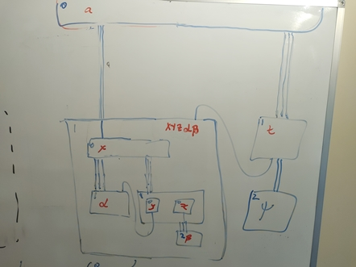
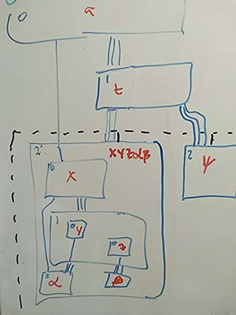

## 28 July 2025
er2flex diagramming ---  Support presentation of ER logical models using the flex diagramming system.

### Background 
1. Already have er2flex.xslt which transforms a logical ER model into a flex diagram.
2. Recently improvements were made in the changes of 07 May 2025, 15th May 2025, 28 May 2025.
3. The layout rules have someway to go to being useful without  intervention.
4. A next generation of auto layout is possible and is described in day book 13th may 2025.
5. Before we design and implment that next generation then the flex diagram approach can be made useable with some improvements in the auto layout plus the ability to have additional directives 
augment the auto-layout algorithm.
6. This approach will also make it possible to alter the styling of the diagram by the inclusion of styling directives.
7. Experimentation has revealed a weakness when entity types are positioned to be centred. 
Get a circularity of route placement and enclosure width and a positioning. Can be avoided by having routes outside of the enclosure within which enclosures are being centered. 

### Overview
1. Improve the algorithm for calculating width of text strings.
2. Support modular approach allowing presentation in a different file to the logical model but supporting assemble and consolidate steps in er2flex.
3. Modify er2flex to generate a  diagram level enclosures to include all other enclosures
but which excludes routes. (This to enable use of centre directives whilst avoiding the route and centering circularity.) 
4. Improve the y positioning to minimise the number of topdown routes that are routed back up the diagram. 
In the hand drawn example below,  the current rules for `y` value, position `C` below `A` as shown on the left whereas manually, in such a case, we would position  `C` below `B`, as shown on the right.

### Analysis of rule y1 in file `ERmodel.flex_pass_two_module.xslt`
 There is a piece of code in rule y1 in which  compositionalDepth is used but which has been
commented out. The idea is good but need to make it work.
The idea is that when using y1 to find an appropriate compositional parent --- should use one that is on the shortest route up compositions to the root of the document. 
I can reveal the current weakness of not having this shortest-upward-path condition 
 by changing the order of the entity type definitions in the example `quadrant_routes...logical`. 
 By moving type Q3 to the top of the document 
(after absolute) I get a long strung out chain of descending entity types because `Q3` is chosen as the primary compositional parent of `centre`. By fixing the code in rule y1 (using compostionalDepth)  I should get a more compact (shallower) diagram. 

### Modified requirement for compositionalDepth Renamed `yPositionalDepthShort`
1. Currently compositionalDepth is only defined for outermost enclosures. Need to define compositionalDepth for all enclosures and to rename it to being `yPositionalDepthShort`
+ define two enclosures to be siblings if they are both outermost enclosures or else if they are both nested within the same parent enclosure.
+ define an enclosure to be `yPositionalDepthShort` 0 if it has no incoming topdown routes into it 
from a sibling enclosure. 
+ otherwise define the `yPositionalDepthShort` of an enclosure to be one greater than the minimum `yPositionalDepthShort` of sibling enclosures from which there is an incoming top down route. Examples are given below in the image on the left.

### Requirement for yPositionalDepthLong
The choice of the short depth was made for convenience of the implementation. It means that the rule y1 positions an enclosure nearer the root of the diagram or the surrounding enclosure and this in turn maximises the number of top down routes that have to be routed back up the diagram. This is a design choice and it qouldn't be the way that I would proceed ususally. On the left below 

### Example
A single example with different choices of yPositionalParent.

On the left, each enclosure is annotated with yPositionalDepthShort
and the piping around routes or route sections indicates the yPositionalParent according to the current algorithm
(but after compositionalDepth/yPositionalDepthShort is implemented on non-outermost enclosures).

On the right, each enclosure is annotated with yPositionalDepthLong
and the piping around routes or route sections indicates the yPositionalParent according to the modified algorithm
proposed in this change.

 

### Implementation
1. New string width function in source file `diagram..functions.module.xslt`.
+ old functions kept for use from old ERmodel2.diagram code because there is a discrepancy which I haven't investigated.
2. Add two additional passes into `er2flex.xslt` to "assemble" and "consolidate".
3. Change `er2flex.xslt` to explicitly position absolute at the top of the diagram (currently relies on it being at the start of the file but it may not be after assemby and consolidation.)
4. Tidy up code by removing use of `abstract` and replacing by use of `entryContainer` and `exitContainer` as introduced in the change of 7th May 2025. Reasoning. 'abstract' is only define 
compositionalDepth for outermost enclosures and for these abstract is same as entryContainer or exitContainer. 
5.  There is a piece of code in rule y1 in which  compositionalDepth is used but which has been
commented out. The idea is good but need to make it work.
The idea is that when using y1 to find an appropriate compositional parent --- should use one that is on the shortest route up compositions to the root of the document. 
I can reveal the current weakness of not having this shortest-upward-path condition 
 by changing the order of the entity type definitions in the example `quadrant_routes...logical`. 
 By moving type Q3 to the top of the document 
(after absolute) I get a long strung out chain of descending entity types because `Q3` is chosen as the primary compositional parent of `centre`. By fixing the code in rule y1 (using compsotionalDepth)  I should get a more compact (shallower) diagram. 

Need revised defintion of compositional depth.

### Testing
Try and produce useable diagrams for all selectedExamples.
+ cricket

### Completion Date 

